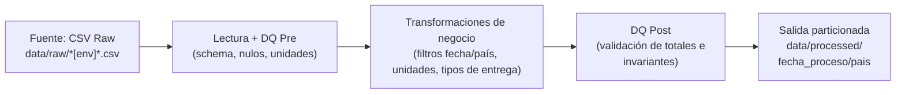
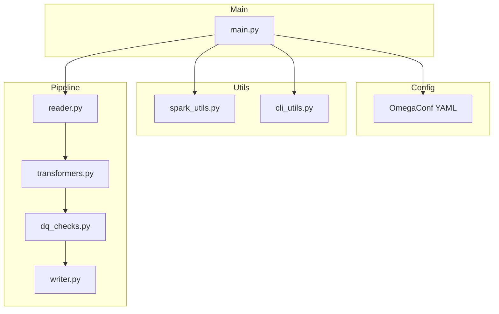
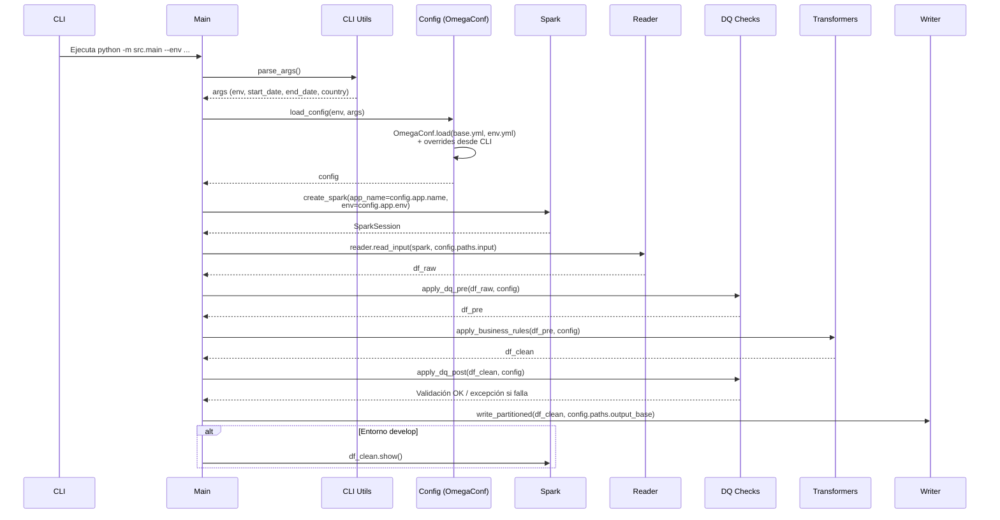

# Prueba Técnica – Pipeline de Procesamiento de Datos con PySpark y OmegaConf

Este repositorio contiene una solución completa para procesar un archivo CSV aplicando una serie de transformaciones, validaciones de calidad de datos y escritura final del dataset procesado en formato particionado por fecha.  
El proyecto es totalmente reproducible y portátil gracias al uso de Docker y Docker Compose.

---

## 1. Diseño General de la Solución

La solución está construida siguiendo estos principios:

- Separación clara de responsabilidades entre lectura, transformaciones, calidad de datos y escritura.
- Configuración externa mediante archivos YAML usando OmegaConf.
- Posibilidad de ejecutar el pipeline con diferentes parámetros: rango de fechas, país y entorno.
- Contenedorización con Docker para evitar problemas de ambiente.
- Validaciones robustas antes (pre DQ) y después (post DQ) de las transformaciones.
- Estructura de proyecto modular, mantenible y orientada a buenas prácticas de ingeniería de datos.

---

## 2. Uso de Docker

Docker se utiliza por los siguientes motivos:

- Asegura que el pipeline se ejecute de manera consistente, independientemente del ambiente o sistema operativo del usuario.
- Permite encapsular todas las dependencias (Python, PySpark, Java, OmegaConf).
- Facilita las pruebas en distintos entornos (develop, prod) sin necesidad de configuraciones manuales.
- Evita problemas de instalación de Spark o versiones incompatibles.

La solución completa se ejecuta únicamente a través de Docker y Docker Compose, de modo que no es necesario instalar PySpark localmente.

---

## 3. Estructura de Carpetas del Proyecto
```bash
.
├── config/
│ ├── base.yml
│ └── env/
│ ├── develop.yml
│ └── prod.yml
├── data/
│ ├── raw/
│ └── processed/
├── src/
│ ├── main.py
│ ├── utils/
│ │ ├── cli_utils.py
│ │ ├── spark_utils.py
│ ├── pipeline/
│ │ ├── reader.py
│ │ ├── transformers.py
│ │ ├── dq_checks.py
│ │ └── writer.py
├── Dockerfile
├── docker-compose.yml
├── requirements.txt
```
## 4. Configuración con OmegaConf

La configuración principal se encuentra en:

<code> configs/base.yml </code>

Valores por defecto definidos:

```yaml
filters:
  start_date: "2025-01-01"
  end_date: "2025-12-31"
  country: ""
```
Consideraciones importantes:
- Las fechas deben estar en formato YYYY-MM-DD.
- El valor de country puede dejarse vacío; en ese caso no se aplica filtro de país.
- Los archivos dentro de configs/env/ (develop.yml, prod.yml) permiten redefinir rutas y parámetros específicos por entorno.
- La función load_config() combina base.yml + env.yml y aplica overrides proporcionados desde CLI.

## 5. Ejecución de la Solución
### 5.1. Construcción del Contenedor

Antes de ejecutar el pipeline por primera vez, construir la imagen:

```bash
docker compose build
```
Esto instala Python, Java y PySpark dentro del contenedor y deja el ambiente listo para ejecutar el pipeline.

## 5.2. Ejecución en Entorno de Desarrollo (develop)

Ejecutar sin parámetros adicionales (usa las fechas por defecto de base.yml):

```bash
docker compose run --rm app
```
Ejecutar con parámetros personalizados:
```bash
docker compose run --rm app \
    python -m src.main \
    --env develop \
    --start_date 2025-01-01 \
    --end_date 2025-01-31 \
    --country GT
```
En el entorno develop el pipeline imprime el DataFrame final usando df_clean.show().

### 5.3. Ejecución en Entorno de Producción (prod)
Ejecutar con parámetros:
```bash
docker compose run --rm app \
    python -m src.main \
    --env prod \
    --start_date 2025-03-01 \
    --end_date 2025-03-31 \
    --country SV
```
Cuando no se especifican parámetros, se utilizan automáticamente los valores definidos en configs/base.yml.

## 6. Comportamiento de los filtros
La especificación original de la prueba solicitaba generar la salida únicamente con una partición por fecha:

<code>data/processed/{fecha_proceso}/</code>

Esto implica lo siguiente:
Si el rango de fechas incluye múltiples países,y se ejecuta la solución una vez por país (por ejemplo, GT y luego EC), el resultado del segundo país sobrescribirá el del primero, porque ambos países escriben en la misma partición por fecha (en caso de tener fechas en común).

La especificación no solicita particionar por país, únicamente por fecha.
Por esa razón, la implementación respeta el requerimiento original, pero se documenta esta limitación inherente al diseño pedido.

### Solución aplicada

Para evitar esta pérdida de información, se implementó una estructura más robusta en writer.py, generando particiones por fecha y por país, siguiendo el patrón:

<code>data/processed/{fecha_proceso}/{pais}/</code>

Este cambio se implementa en <code>src/pipeline/writer.py</code>:
```python
df_write = (
    df.withColumn(
        "fecha_folder",
        f.date_format("fecha_proceso", "yyyyMMdd")
    )
)

df_write = df_write.cache()

pairs = [
    (row.fecha_folder, row.pais)
    for row in (
        df_write
        .select("fecha_folder", "pais")
        .distinct()
        .collect()
    )
]

for fecha_str, pais in pairs:
    (
        df_write
        .filter(
            (f.col("fecha_folder") == fecha_str) &
            (f.col("pais") == pais)
        )
        .write
        .mode("overwrite")
        .parquet(f"{output_base_path}/{fecha_str}/{pais}")
    )
```

Al separar la salida por país, se evita la sobrescritura y se garantiza que el pipeline sea idempotente por país. Esta modificación no altera el propósito de la solución, solo evita una condición de diseño que produciría pérdidas de datos.

## 7. Calidad de Datos (Pre DQ y Post DQ)
### 7.1. Pre DQ

Antes de las transformaciones se realizan validaciones para asegurar que el dataset sea procesable:

- Parseo seguro de fecha_proceso.
- Eliminación de:
    - fechas inválidas,
    - valores nulos en columnas críticas,
    - unidades fuera del dominio permitido,
    - cantidades no válidas.
- Eliminación de duplicados físicos.

Estas validaciones permiten completar una limpieza previa a la transformación de los datos.

### 7.2. Post DQ

Después de las transformaciones se valida que el resultado sea consistente:

- <code>total_unidades</code> debe ser mayor a 0.
- Las unidades por tipo (unidades_rutina, unidades_bonificacion) no pueden ser negativas.
- Se verifica la consistencia de negocio: <code>total_unidades >= unidades_rutina + unidades_bonificacion</code>
- Si alguna regla falla, se lanza una excepción y el pipeline se detiene.

Estas validaciones garantizan que las reglas de negocio se aplicaron correctamente y que el output es confiable.

## 8. Nombramiento y adición de columnas
### 8.1 Estándar de nombramiento de Columnas
Se aplicó un estándar de nombres en **snake_case** por su legibilidad, consistencia y compatibilidad con Spark, SQL y herramientas de analítica. Además, se realizaron ajustes semánticos para que cada columna represente con mayor claridad su significado en el modelo de datos:

- **Sufijo** ```_id``` en columnas que representan códigos o identificadores (```transporte_id```, ```ruta_id```, ```material_id```). Esto permite distinguir fácilmente valores categóricos codificados de atributos numéricos o métricas.

- **Claridad semántica en métricas**: ```precio_unitario``` se usa en lugar de ```precio``` para indicar explícitamente que corresponde al costo por unidad del material.

- **Definición explícita de la unidad:** ```unidad_base``` reemplaza ```unidad``` para dejar claro que la columna ya está normalizada a una unidad estándar definida en la configuración.

- **Prefijo** ```es_``` **para campos booleanos:** ```es_bonificada``` comunica de forma directa que el valor es verdadero/falso, siguiendo buenas prácticas de nombrado para atributos lógicos.

- **Columnas derivadas ordenadas** (```anio_proceso```, ```mes_proceso```) Estas variables se nombran siguiendo el mismo estándar y permiten facilitar análisis posteriores por jerarquías temporales.

### 8.2 Columnas Adicionales
- ```es_bonificada```:
Permite identificar rápidamente si una entrega incluye unidades por bonificación, facilitando análisis de participación, impacto promocional y separación entre entregas de bonificación y no bonificación.

- ```anio_proceso``` y ```mes_proceso```:
Se agregan para habilitar agrupaciones y análisis temporales sin necesidad de recalcular estas derivadas en cada consulta. Permiten filtrar, ordenar y segmentar los datos por periodos de tiempo de forma eficiente.

## 9. Ejemplos de Ejecución

Ejecutar sin filtro de país:

```bash
docker compose run --rm app \
    python -m src.main --env develop \
    --start_date 2025-02-01 \
    --end_date 2025-02-28
```

Ejecutar filtrando únicamente Guatemala:
```bash
docker compose run --rm app \
    python -m src.main --env prod \
    --start_date 2025-05-01 \
    --end_date 2025-05-15 \
    --country GT
```

## 10. Diagramas

### 10.1 Diagrama de Flujo de Datos



### 10.2 Diagrama de componentes



### 10.3 Diagrama de Secuencia
El diagrama de secuencia muestra el orden exacto en que cada componente del pipeline es invocado, desde que se dispara el comando hasta que los datos son leídos, validados, transformados y escritos.

